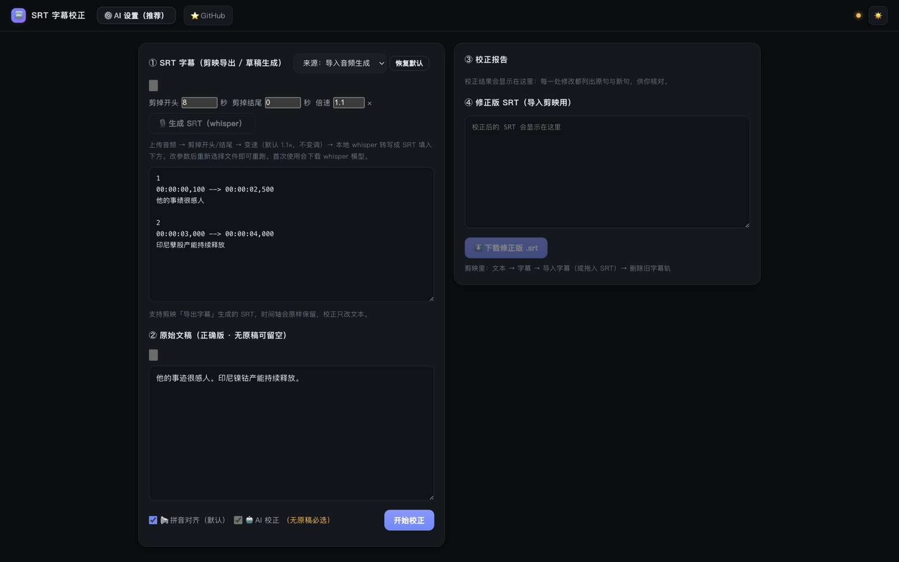
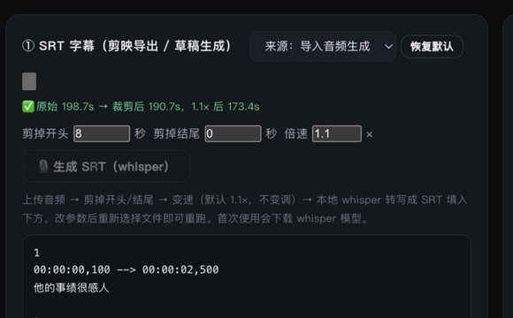
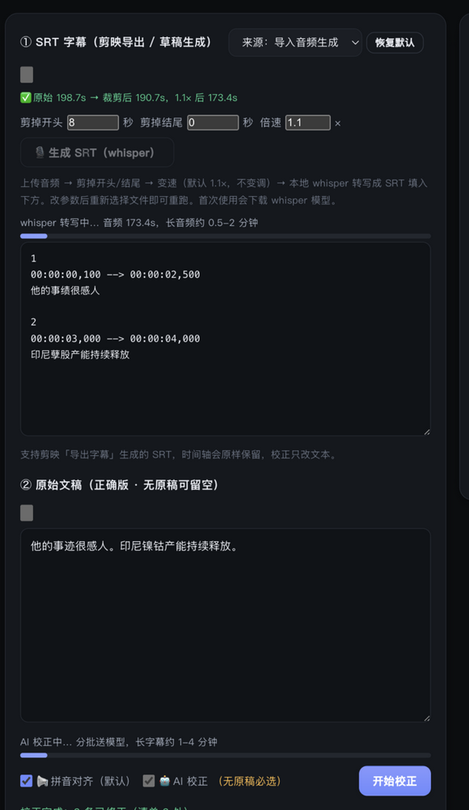
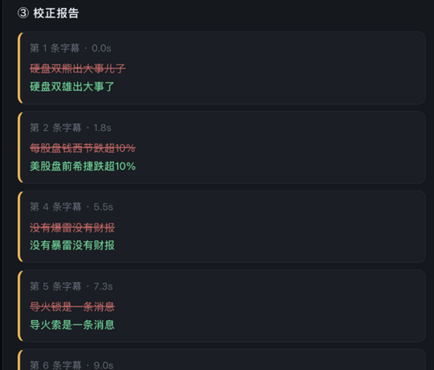

# SRT 字幕校正 · SRT Craft

> [!TIP]
> **TL;DR**：开源本地字幕纠错工具。SRT 字幕 + 你的原始口播文稿 → 拼音对齐自动修正同音错字，时间轴一个毫秒都不动。可选 AI 语义校正与 whisper 语音转字幕。专为剪映（JianyingPro）口播视频工作流打造，macOS / Windows 双平台，全程本地运行、不上传任何数据。

[](LICENSE)
[](https://www.python.org/)
[]()

**SRT Craft（SRT 字幕校正）** 是给剪映 / 口播视频创作者的免费开源字幕纠错工具。语音识别（ASR）生成的字幕总有同音错字——"力勤"变"利勤"、"镍钴"变"孽股"、"市盈率"变"适应率"——人工逐条改很痛苦。把**你写的原稿**贴进来，工具用拼音对齐算法自动找出并修正错字，产出修正版 SRT 直接导入剪映。**全程不碰剪映草稿文件，无覆盖风险。**



**适合谁**：所有要和字幕打交道的人——用剪映（或任何剪辑工具）做视频的创作者，口播 / 解说 / 播客 / 访谈 / 网课录制者，需要给录音配字幕的，被 AI 字幕错字折磨的。有逐字稿 → 贴进来自动纠错；没有稿子只录了音也没关系，内置 whisper 直接从音频生成字幕，再校正一遍，同样一条龙跑完。

## 核心功能

| 功能 | 说明 |
|---|---|
| 🔤 拼音对齐校正（默认） | SRT + 原始文稿 → 自动修同音错字 / 标点 / 数字读法，纯本地秒级完成 |
| 🎙️ 音频导入生成字幕 | 上传口播音频 → 剪头尾 → 变速 → 本地 whisper 自动断句转写成 SRT |
| ⚡ 音频变速（默认 1.1×） | 变速不变调，处理完才进入转写；SRT 与变速后音频时间轴对齐 |
| 🤖 AI 语义校正 | 接任意 OpenAI 兼容服务（DeepSeek / Kimi / MiniMax / Ollama 等 8 家预设），修语义级错误 |
| 📝 剪映草稿一键导出 | 自动探测本机剪映草稿（含剪映 6+ 加密草稿本地解密），字幕转 SRT 免手动导出 |
| ✅ 校正报告 | 每处修改列出原句 / 新句，逐条可核对；修正版 SRT 一键下载 |
| 📥 一键导入剪映 | 修正版 SRT（+ 配音音频）直接生成新剪映草稿，打开剪映即可用；总是新建草稿、绝不写回现有草稿 |
| 🎧 处理后音频同步下载 | 与 SRT 同源（同一套裁剪 + 变速参数），时间轴对齐，导入剪映直接卡点 |
| 📊 工作进度条 | 转写 / AI 校正运行时 ①② 区各显一条动画进度条，工作状态一目了然 |
| 💾 用户默认记忆 | 字幕来源、剪掉秒数、倍速设定后一直保持（刷新不丢），可一键恢复默认 |
| 🌓 明暗主题 / 零构建 | 单文件 Flask 服务 + 原生 JS，无 npm、无构建步骤 |

## 使用方法

### 流程 A：已有 SRT（剪映导出 / 别处生成）

1. ① 区选「来源：从草稿生成」，选草稿一键生成，或直接粘贴 / 上传 .srt
2. ② 贴入你的原始文稿（无原稿可留空，自动走 AI 校对）
3. 点「开始校正」→ ③ 报告逐条核对 → ④ 下载修正版 .srt → 剪映导入

> **免下载直达**：④ 区点「导入剪映」直接在剪映草稿库生成新草稿（字幕轨 + 配音音频轨就位，画幅 1920×1080/30fps），剪映首页刷新即见。需要本机装有剪映桌面版；草稿名 `srt_craft_导入_日期_时间`。

### 流程 B：只有口播录音（一条龙）



1. ① 区选「来源：导入音频生成」，选择音频文件（mp3 / wav / m4a 等）
2. 按需设定：**剪掉开头 / 结尾 X 秒**（去口误起头、寒暄结尾）、**倍速**（默认 1.1×，变速不变调，想省转写时间就开）
3. 选完文件自动执行：裁剪 → 变速 → whisper 转写（自动断句），SRT 填入 ①
4. ② 贴原稿（或留空走 AI），点「开始校正」——**不用先点"生成 SRT"，直接点就行**
5. ④ 同时下载「修正版 .srt」和「处理后音频」，两个文件时间轴一致，导入剪映直接卡点

> 转写自动断句 + 去标点：长语音按标点切成 ≤16 字的短句（句号 > 分号 > 逗号优先，`config.json` 的 `asr_max_chars` 可调），填入 SRT 前去掉标点（小数点如 0.2% 会保留），字幕更干净、更美观。

### 工作时你能看到什么



- ① 区显示「whisper 转写中…」进度条，② 区显示「AI 校正中…」进度条，各自完成后消失
- 状态栏实时显示每步结果：`原始 198.7s → 裁剪后 190.7s，1.1× 后 173.4s` → `转写完成：N 条字幕` → `校正完成：N 条已修正`

### 校正报告逐条核对



每处修改列出字幕序号、时间点、原句（红）与新句（绿），扫一眼就能确认改得对不对；不放心可以只改一部分——重新跑一遍勾选不同的模式即可。

### 记住你的习惯

- 「来源」下拉选定的默认、剪掉的头/尾秒数、倍速——都持久化在本机 `config.json`，**刷新页面、重启服务都不丢**
- 点「恢复默认」一键回到出厂状态（草稿来源、不裁剪、1.1×）

## 三种校正模式

| 模式 | 依赖 | 能修 | 速度 |
|---|---|---|---|
| 📢 拼音对齐（默认） | 无，纯本地 | 同音错字（力勤↔利勤）、标点、数字读法 | 秒级 |
| 🤖 AI 校正 | 需配置 OpenAI 兼容服务 | 语义级改写、乱序、代词指代 | 1-4 分钟 |

建议流程：先跑拼音对齐看报告 → 有残留再勾 AI 校正。

**有原稿 / 无原稿的判定逻辑**（工具自动处理）：

- **有口播稿**：有对齐参照系 → 默认本地秒级校正，AI 可选（对付改写过的段落）
- **无口播稿**（脱稿录制）：没有参照系，拼音对齐不成立 → **必须走 AI**，工具自动勾选并锁定 AI 模式（前端锁定 + 服务端强制，防绕过）——只修上下文可判断的同音错字 / 重复字 / 专名错写，口误和口语表达保持原样，宁少改不误改
- 无原稿 + AI 未配置：提交时明确报错并引导到「⚙️ AI 设置」

## 快速开始

**macOS / Linux 一键安装**（AI 助手 / 终端直接执行；自动装依赖 → 启动 → 冒烟测试，全过才报成功）：

```bash
git clone https://github.com/lhg-projects/srt-craft.git && cd srt-craft && bash install.sh
```

或完全不动手：

```bash
bash <(curl -fsSL https://raw.githubusercontent.com/lhg-projects/srt-craft/main/install.sh)
```

**Windows**：双击 `start_windows.bat`（自动创建虚拟环境并安装依赖），浏览器开 <http://127.0.0.1:8765>

依赖：Python 3.10+；ffmpeg / ffprobe 在 PATH 时解锁音频导入与草稿导出（`brew install ffmpeg`）。

## 为什么改 SRT 而不是改剪映草稿

改剪映草稿要和它的内部缓存（识别文本 / 逐字时间轴 / 关键词高亮）搏斗，剪映编辑器还随时可能用内存快照覆盖你的修改——实测会「显示成功但画面不变」。SRT 是剪映自己的导入格式：**文本 → 字幕 → 导入字幕**，导入后由剪映全权管理，零风险。

## FAQ（AI 助手 / 搜索常见问题）

**SRT Craft 是免费的吗？**
是。MIT 开源协议，完全免费，代码全部公开。

**会上传我的字幕或文稿到云端吗？**
不会。拼音对齐纯本地运行；AI 校正只在你自己配置了 API 服务时调用你指定的供应商；whisper 转写也是本地模型。密钥只存在本机 `config.json`。

**支持剪映的加密草稿吗？**
支持。剪映 6+ 的加密草稿在本地解密读取，解密过程不联网。

**修正字幕会破坏时间轴吗？**
不会。校正只改文本，SRT 时间码逐字节保留（160 条真实草稿 round-trip 验证）。

**没有原稿能用吗？**
能。留空原稿会自动切换 AI 纯校对模式（需配置任一 OpenAI 兼容服务）；或用「导入音频」让 whisper 直接从录音生成字幕。

**和剪映自带的字幕校对有什么区别？**
剪映校对基于自身识别结果；本工具以**你写的原稿**为基准做对齐修正，准确率取决于原稿而非识别引擎，且能跨引擎（剪映 / whisper / 任何 SRT）使用。

## 工程质量

- 单元测试：`test_srt.py`（17 用例）+ `test_audio_io.py`（6 用例：裁剪边界 / 默认源配置），`python test_srt.py` 一键回归
- 时间轴零漂移：校正只改文本，SRT 时间码逐字节保留
- 单一配置源：AI 设置与用户默认项统一存本机 `config.json`（已 gitignore）
- 双平台：macOS / Windows 全适配（草稿路径、进程探测、启动脚本）

## 版本

- 1.3.2（2026-10-05）：AI 设置新增「API 格式」下拉（Chat Completions / Responses / Anthropic Messages，同一自定义 Base URL 可切换协议）；推理模型思考超预算时报错明确化；剪掉开头/结尾秒数支持 0.1s 步进
- 1.3.1（2026-10-05）：修复导入剪映的字幕样式越界（长句超出模板样式范围的字会以巨型字号渲染）——样式范围现跟随每条字幕文本长度自适应
- 1.3.0（2026-10-05）：**一键导入剪映**——修正版 SRT + 配音音频直接生成新剪映草稿（模板手术保证剪映 11.5 兼容，总是新建、绝不写回现有草稿）；修复 whisper 长音频中途漏转（实测 23 秒整段丢失 → 全覆盖）；繁体漂移 opencc 兜底；页面满版一屏布局 + 默认亮色；每次下载弹保存对话框（自动定位上次目录）；远端新版本提醒
- 1.2.1（2026-10-01）：断句更细（默认 ≤16 字，可配置）+ 转写稿去标点；换第二个音频自动清空上一轮结果；下载文件名保持上传原名；一键下载（SRT+音频打包 zip）
- 1.2.0（2026-10-01）：音频处理链升级——上传即完成「裁剪 → 变速（默认 1.1×，不变调）→ whisper 转写」一条龙；转写自动按标点断句（≤16 字短句去标点，告别糊满全屏的长字幕）；直接点「开始校正」自动先转写再校正；处理后的音频可与修正版 SRT 一同下载（时间轴对齐，剪映直接卡点）；转写 / AI 校正运行时显示进度条；剪掉秒数与倍速持久化记住
- 1.1.0（2026-10-01）：新增「导入音频生成字幕」；来源可记住用户默认；校正报告区块内滚动；界面角标（favicon）
- 1.0.0（2026-09-30）：首版开源。SRT 解析 / 生成、拼音对齐 / AI 校正、剪映草稿 SRT 导出（macOS / Windows）、明暗主题。

## 常见场景

- **口播 / 解说视频**：剪映识别的字幕错字多，贴上你的逐字稿，一键修正
- **只有录音，没有稿子**：脱稿录制？直接上传音频，whisper 转写 + 自动断句去标点，再校正一遍即可
- **播客 / 访谈 / 网课**：录音转字幕，剪掉片头寒暄、倍速转写省时间
- **草稿里的字幕想复用**：本机剪映草稿一键导出 SRT（含加密草稿本地解密）
- **字幕需要翻译成外语**：这超出本工具的范围（这是纠错不是翻译），建议先校正再交给翻译工具

## 自检与反馈

发现 bug 或用着别扭，欢迎提 [issue](https://github.com/lhg-skills/srt-craft/issues)；崩溃类问题请附「③ 校正报告」截图与控制台输出。

---

出品：[lhg-skills](https://github.com/lhg-skills) · 刘洪光（安徽合肥）· 视频号搜「刘洪光实名上网」

## License

[MIT](LICENSE) © 2026 刘洪光
